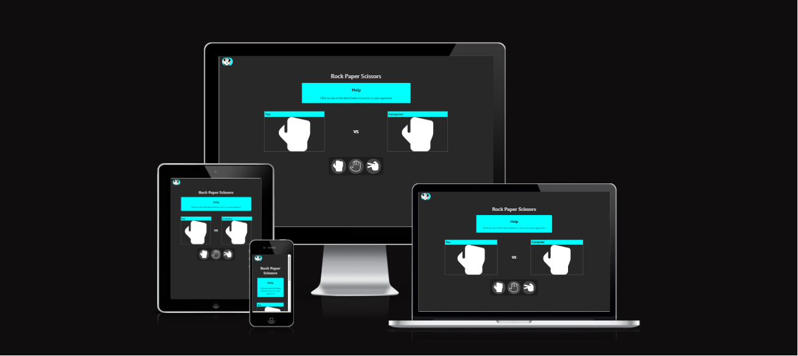
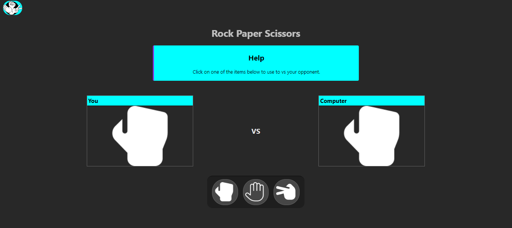
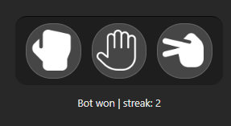
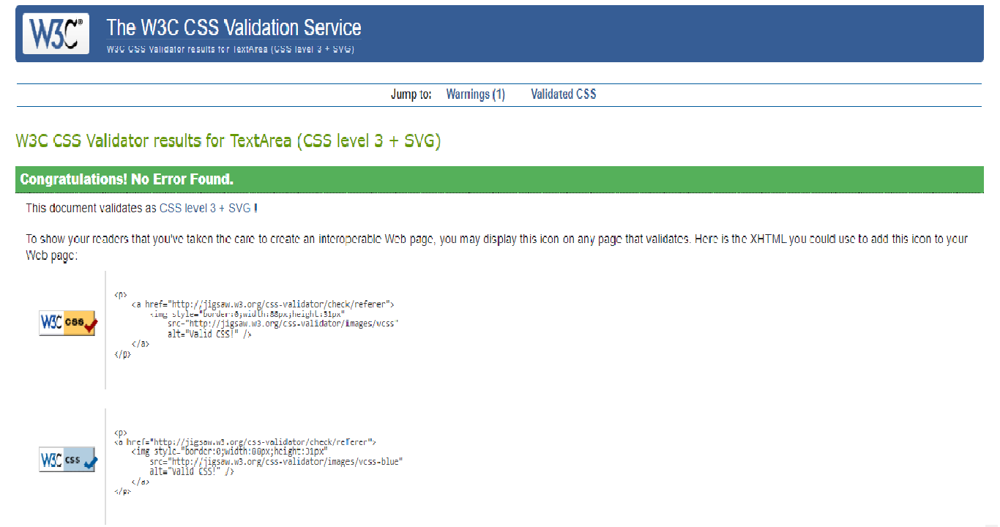
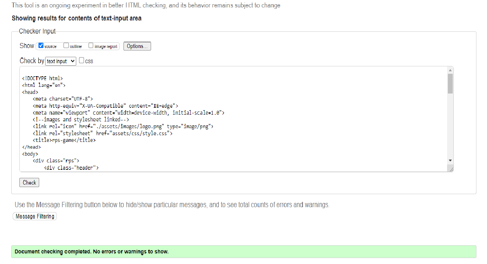

# rps-game

Click on this [Link](https://ui.dev/amiresponsive?url=https://ibraheemcodes.github.io/rps-game/) for the live and responsive website
This rps(Rock paper and scissors) game is targeted towards any individuals wanting a little challenge against a computer for fun. 
Main Page is responsive on phone tablets and laptops. 

[Main Page](https://8000-ibraheemcodes-rps-game-pw7yi09ceu.us2.codeanyapp.com/) 
I have included features such as score section so the user can see how many time they have won against the computer.
The purpose of the dark background is to create a visually appealing modern look also to reduce any strain on the users eyes, dark theme can further draw the users attention to the core information such as the buttons and texts.
In the light blue section i have written a very brief Help guide to inform the user on what to do which is "Click on one of the items below to use to vs your opponent.".
Furthermore,In this page i have made it very easy for the user to understand and be able to play the game. The text is not too small nor too big and it even determines who is the winner once the user has chosen its option whether it is Rock, Paper or scissors. It can say the following outcomes "you Won", "Bot Won" and "Its a Draw". It will say at the bottem.

# JavaScript
I have included alot of javaScript for the game to optimize correctly which has been tested many times to show the correct output, this is done through player class and a game class, each class has its own getter and setter methods to update the respected variables such as score,  streak, id and names more specifcally "user" meaning me and "bot" imlying computer. i have also created function named doRps which handles logic and user interface.

# Testing
All links have been tested and checked via the validator links for both the CSS  HTML .

# Deployment
I deployed my work through github where i selected the pages section and select Branch as Main branch so it is pusblished through the main/ root where upon selecting it said, it was sucessfully deployed and a live link was provided which is https://ibraheemcodes.github.io/rps-game/.

# Credits
The font icons i used from are [font awesome](https://fontawesome.com/v4/icons/).
The fonts i used are from [Google font] (https://fonts.google.com/)
I also had some help from my cousin and other repositories from codes institute with making the rps site .

